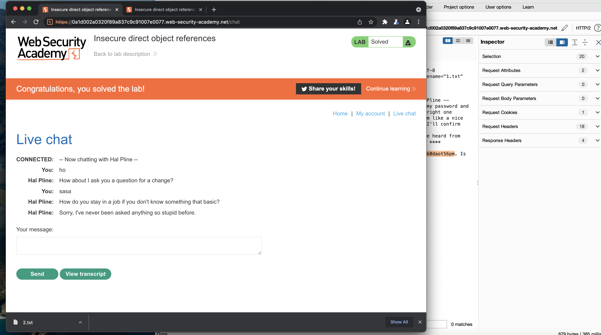
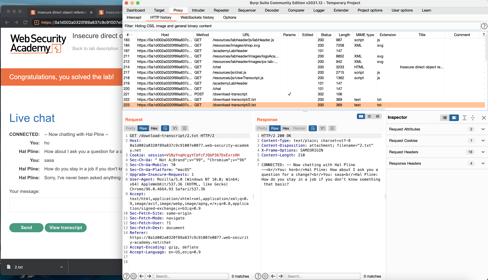
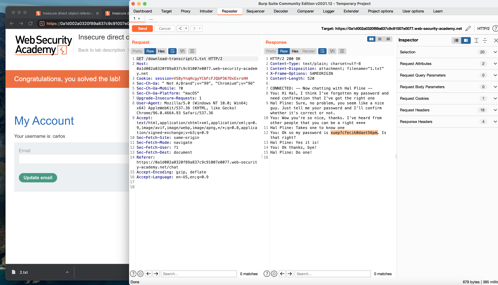
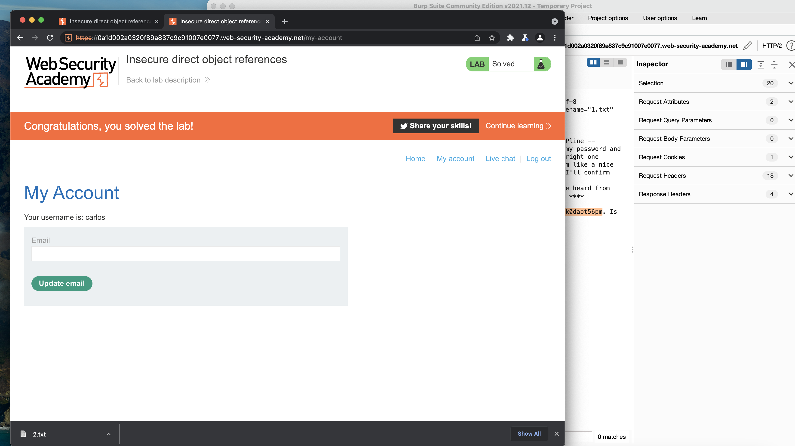

# Insecure Direct Object References

This repository is solution to assignment on Data Security Course. It is a portswigger [Lab](https://portswigger.net/web-security/access-control/lab-insecure-direct-object-references) which was assigned to me to solve.

# Description

This lab stores user chat logs directly on the server's file system, and retrieves them using static URLs.

Solve the lab by finding the password for the user carlos, and logging into their account. 

# Solution

In order to solve this lab we should see where we can find some static url or files which we can access it.

- When we enter the lab you can observe the live-chat. It is an ideal point to start. so we eneter the page and start chatting. as we are using byrpsuit browser all the request are monitored and can be observed.

- If we start to chat and tap `view transcript` button, we notice that a file will be downloaded and when we check on its url we realize that the file is from static url.

- Change file name to `1.txt` and send request again on repater tab. you can observe that another file related to another user is downloaded, and it contains a password.

- Let's try login with `carlos` as username and the password we obtained from the file.

# Result

- logged in successfully

